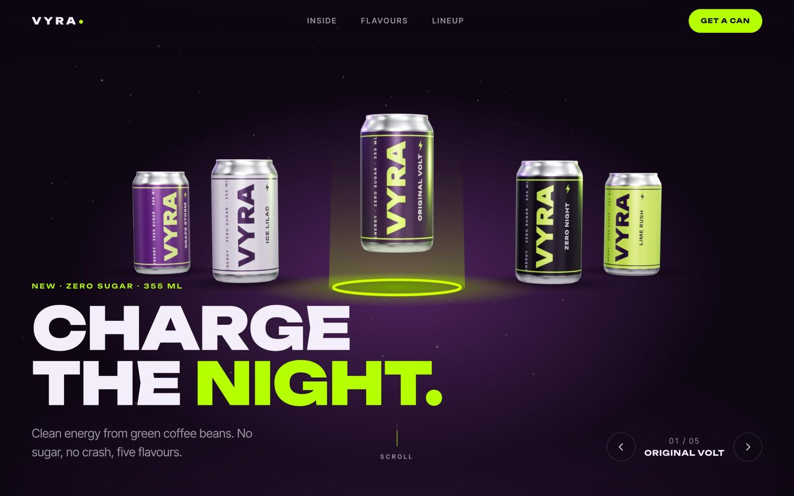
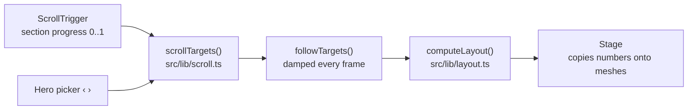
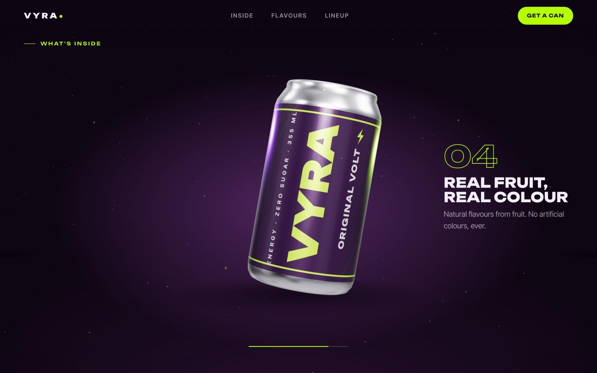
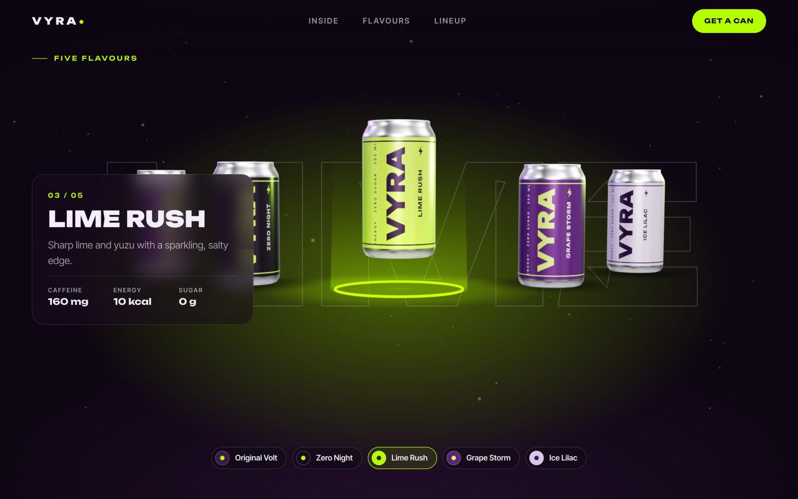
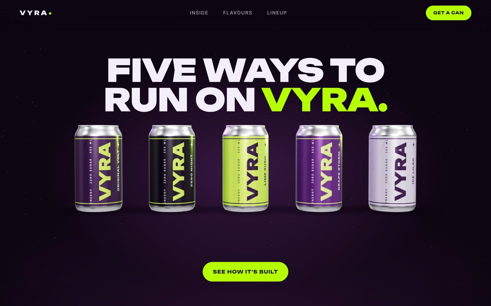
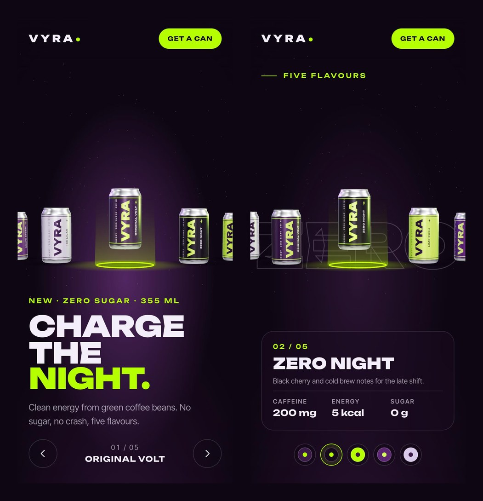

<div align="center">

# VYRA Energy

**A scroll-driven 3D product website for a concept energy drink: five procedural cans on a glowing stage that rise, spin, slide and line up as you scroll.**

[](https://github.com/arslanagayev/vyra-energy/actions/workflows/ci.yml)
[](https://github.com/arslanagayev/vyra-energy/actions/workflows/deploy.yml)
[](LICENSE)
[](tsconfig.app.json)
[](https://threejs.org)



### [Live demo](https://arslanagayev.github.io/vyra-energy/)

</div>

> VYRA is a **fictional brand** made for a design portfolio. It is not a real product, and the site says so on the cans and in the footer.

---

## Features

- **Five procedural 3D cans**: no models or image files. Each can is a `LatheGeometry` aluminium body from a measured 355 ml profile, a printed sleeve and an extruded pull tab. The label (vertical logo, flavour name, nutrition panel, barcode) is drawn on a 2D canvas at load time, so all copy and colours come from one data file.
- **A scroll story in four acts**, each a pinned section:

  | Section       | What scrolling does                                                                                       |
  | ------------- | --------------------------------------------------------------------------------------------------------- |
  | Hero          | Cans rest on an arc; the selected one floats above a glowing ring. ‹ › (or ← →) turns the carousel.       |
  | What's inside | The selected can comes forward and spins 1¼ turns while four feature callouts take turns beside it.       |
  | Five flavours | The carousel turns through every flavour; a glass card, the swatches and a giant outlined word follow it. |
  | Lineup        | All five cans walk into a row, in flavour order, under the closing headline.                              |

- **Light without post-processing**: the ring, its beam, the contact shadows and the dust are additive or alpha sprites, so the canvas stays transparent over a CSS glow that changes colour with the flavour in the middle.
- **Buttery but honest scrolling**: Lenis smooths the wheel, ScrollTrigger only measures, and the scene eases towards its targets with frame-rate independent damping. Clicking a swatch or a nav link glides to a moment where the scene is settled, not just to the top of a section.
- **Works everywhere**: a phone layout with its own camera framing, a reduced-motion mode and a readable 2D page when WebGL is missing.

## How the scroll choreography works

The whole animation is a pure function of a few numbers. Nothing in the 3D scene knows about scrolling, and nothing in the scroll code knows about three.js:



1. **Measure.** Six ScrollTriggers report how far each phase has run (`#inside` scrolling in, `#inside` pinned, and so on). They have no callbacks and animate nothing.
2. **Decide.** `scrollTargets(progress, heroCenter)` turns that into a `SceneState` target: `focus` (close-up), `spin`, `lineup` and `center`, a _continuous_ index of the can in the middle of the carousel.
3. **Ease.** Every frame, `followTargets()` moves the current state towards the target with exponential damping (`1 - e^(-λ·dt)`), so a fast flick or a click on an arrow still glides, at any frame rate.
4. **Pose.** `computeLayout(state)` returns a position, rotation, scale and visibility for each can by blending three poses: `arcPose`, `focusPose` and `lineupPose`. Because `center` is fractional, the carousel can rest between two cans, and `circularOffset()` makes the ring wrap without a jump (the can crossing the seam behind the arc fades out).

```ts
// src/lib/scroll.ts: the full choreography, in one function
export function scrollTargets(progress: SectionProgress, heroCenter: number, count: number) {
  return {
    center: flavorCenter(heroCenter, progress.flavors, count), // turn through all flavours
    focus: progress.insideIn * (1 - progress.flavorsIn), // close-up while "inside" is on screen
    spin: progress.inside,
    lineup: invLerp(0, LINEUP_DONE, progress.lineup),
  };
}
```

Since steps 2 to 4 are plain TypeScript, the choreography is unit-tested without a browser: the selected can is always the highest and frontmost, the arc is symmetric, the wrap seam is hidden, the lineup keeps flavour order, and clicking swatch _j_ scrolls to exactly the progress where flavour _j_ is in the middle (`flavorProgress()` is tested as the inverse of `flavorCenter()`).

## Tech stack

| Area     | Choice                                                                                |
| -------- | ------------------------------------------------------------------------------------- |
| Language | TypeScript 6 (`strict`, `noUncheckedIndexedAccess`, `exactOptionalPropertyTypes`)     |
| 3D       | three.js r186: `LatheGeometry`, `MeshPhysicalMaterial` clearcoat labels, PMREM studio |
| Motion   | GSAP 3.15 ScrollTrigger (measurement only), Lenis smooth scrolling                    |
| UI       | Vanilla DOM and modern CSS (custom properties, `clamp()`, `backdrop-filter`, sticky)  |
| Build    | Vite 8 with three.js in a lazily imported chunk                                       |
| Quality  | ESLint 10 + typescript-eslint (strict, type-checked), Prettier                        |
| Testing  | Vitest 5, happy-dom, V8 coverage                                                      |
| Fonts    | Unbounded and Inter Tight variable fonts, self-hosted via Fontsource                  |
| CI/CD    | GitHub Actions: CI on Node 22 and 24, test-gated GitHub Pages deploys                 |

No UI framework on purpose: a scroll-driven page like this is mostly a render loop and a handful of DOM writes, and well-structured TypeScript keeps both obvious.

## Getting started

Requires **Node.js 22.13+** (22 LTS or 24 LTS; the repository pins 24 in `.nvmrc`, and CI tests both).

```bash
git clone https://github.com/arslanagayev/vyra-energy.git
cd vyra-energy
npm ci
npm run dev
```

Open the printed URL (usually <http://localhost:5173>) and scroll.

To deploy your own copy: make the repository public, set **Settings → Pages → Source** to **GitHub Actions**, then run the Deploy workflow once (**Actions → Deploy → Run workflow**). It lints and tests before it builds and reads the base path from the Pages configuration, so a renamed fork or a custom domain works without changes. While the repository is private the deploy jobs are skipped.

## Scripts

| Script                  | Description                                             |
| ----------------------- | ------------------------------------------------------- |
| `npm run dev`           | Start the Vite dev server with hot module replacement   |
| `npm run build`         | Type-check and create a production build in `dist/`     |
| `npm run preview`       | Serve the production build locally                      |
| `npm run lint`          | Lint with ESLint and type-aware typescript-eslint rules |
| `npm run format`        | Format the codebase with Prettier                       |
| `npm run format:check`  | Verify formatting (used in CI)                          |
| `npm run typecheck`     | Run the TypeScript compiler in build mode               |
| `npm test`              | Run the test suite once                                 |
| `npm run test:watch`    | Run tests in watch mode                                 |
| `npm run test:coverage` | Run tests with V8 coverage and enforce thresholds       |

## Project structure

```text
vyra-energy/
├── index.html                # All copy as real HTML: hero, inside, flavours, lineup, footer
├── public/favicon.svg
├── src/
│   ├── main.ts               # Bootstrap: text first, one frame loop, lazy 3D stage
│   ├── data/
│   │   ├── flavors.ts        # Brand colours, five flavours, four features
│   │   └── fonts.ts          # Font stacks shared by CSS-free code
│   ├── lib/                  # Pure, fully tested logic (no DOM, no three.js)
│   │   ├── layout.ts         # The choreography: SceneState → a transform per can
│   │   ├── scroll.ts         # Section progress → scene targets, feature windows, glow
│   │   ├── state.ts          # Frame-rate independent easing towards the targets
│   │   ├── camera.ts         # Framing per pose and viewport shape
│   │   ├── canProfile.ts     # 355 ml can profile and label proportions
│   │   └── math.ts, color.ts
│   ├── scene/                # three.js, loaded as a separate chunk
│   │   ├── Stage.ts          # Renderer, lights, cans, ring, dust; applies computeLayout()
│   │   ├── can.ts            # Lathe body, label sleeve, pull tab
│   │   ├── labelTexture.ts   # Prints the wrap-around label on a canvas
│   │   ├── effects.ts        # Glowing ring, beam and contact shadows as sprites
│   │   └── support.ts        # WebGL detection without importing three.js
│   ├── ui/
│   │   ├── sections.ts       # ScrollTrigger as a ruler + landing points for links
│   │   ├── scroller.ts       # Lenis on GSAP's ticker (native scroll for reduced motion)
│   │   ├── heroPicker.ts     # ‹ › buttons and arrow keys
│   │   ├── features.ts       # "What's inside" callouts and progress meter
│   │   ├── flavorPanel.ts    # Flavour card, swatches and the giant backdrop word
│   │   ├── reveal.ts         # Intro and heading reveals
│   │   └── anchors.ts, content.ts, loadStage.ts, dom.ts
│   └── styles/               # tokens.css, base.css, sections.css
├── tests/                    # Unit, data, palette, markup and DOM tests
├── docs/                     # Screenshots
└── .github/workflows/        # CI + Pages deploy
```

## Accessibility and performance

**Accessibility**

- Every word on the page is real HTML text; the canvas and the backdrop are `aria-hidden`. Sections are landmarks with headings, the flavour card and the picker label are polite live regions, and the swatches are toggle buttons with `aria-pressed`.
- Everything works with the keyboard: a skip link, ← → for the hero carousel, and in-page links that move focus to the section they scroll to. Focus rings are always visible, in the accent colour.
- `prefers-reduced-motion`: no smooth scrolling, no spin, no idle bob, no text slides, and the intro jumps to its end. The scene still follows the scroll position, which the reader controls.
- Without WebGL (or if the scene fails to start) the page adds `no-webgl`, keeps a CSS glow and the giant flavour word, and every text section still works.
- Body text and accent colours meet WCAG AA against the page background, and a test checks that each can's logo and small print reach 3:1 on the can's own colour.

**Performance**

- The text paints first: three.js (about 147 kB gzipped) lives in its own chunk, fetched with a dynamic `import()` once the label fonts are ready. The main chunk (GSAP, ScrollTrigger, Lenis and the app) is about 56 kB gzipped.
- One `WebGLRenderer`, device pixel ratio capped at 2, no post-processing, shared geometry and metal material across the five cans, and about 30 draw calls per frame.
- GSAP's ticker drives Lenis, ScrollTrigger and the WebGL frame from a single `requestAnimationFrame`, and the loop stops while the tab is hidden.
- DOM writes are skipped when a value has not changed, so a still page does no style work.

## Testing

```bash
npm test               # 160+ unit, data, palette, markup and DOM tests
npm run test:coverage  # enforces ≥ 90 % coverage for src/lib
```

- **Choreography and helpers** (`src/lib`) are covered at 100 % of lines, branches and functions: layout poses, scroll mapping, damping, camera framing, the can profile, maths and colour helpers.
- **Data** is checked for unique ids, hex formats and readable labels on every can.
- **The palette rule is a test**: every colour literal in the shipped CSS, TypeScript, HTML and SVG must be a tint or shade of Charcoal Violet or Cyber Line, or a near-neutral.
- **Markup checks** parse `index.html` for duplicate ids, dangling ARIA and anchor references, untyped or unnamed buttons and decoration exposed to screen readers.
- **DOM tests** (happy-dom) cover the data-driven markup, the feature callouts and the hero picker.
- Rendering code (`src/scene`) and the DOM wiring are excluded from the coverage threshold because they need a real browser and GPU; they were checked by hand at 1440×900 and 390×844.

## Screenshots

| What's inside                                                            | Five flavours                                                          |
| ------------------------------------------------------------------------ | ---------------------------------------------------------------------- |
|  |  |

| Lineup                                                                        | Phone                                                                     |
| ----------------------------------------------------------------------------- | ------------------------------------------------------------------------- |
|  |  |

## Credits

- Inspired by the "Websites in 2026" trend of scroll-driven 3D product pages, in particular energy-drink sites with cans on a glowing stage.
- Palette: combo 03, Charcoal Violet `#3C1A47` + Cyber Line `#B6FF00`, from [@design.deb](https://www.instagram.com/design.deb/)'s colour combos.
- Typefaces: [Unbounded](https://fonts.google.com/specimen/Unbounded) and [Inter Tight](https://fonts.google.com/specimen/Inter+Tight) (SIL Open Font License) via Fontsource.
- Built with [three.js](https://threejs.org), [GSAP](https://gsap.com) and [Lenis](https://lenis.darkroom.engineering).

## Roadmap

- [ ] Playwright end-to-end tests with screenshot comparisons of each section
- [ ] A short scroll-recorded video for the README
- [ ] Ambient occlusion baked into the can texture for softer contact shading
- [ ] A WebGPU renderer path, falling back to WebGL 2

## Author

**Arslan Agayev**, computer science student building interactive web experiences.

- GitHub: [@arslanagayev](https://github.com/arslanagayev)
- Instagram: [@arslanagayev.dev](https://www.instagram.com/arslanagayev.dev/)

## License

[MIT](LICENSE) © 2026 Arslan Agayev
